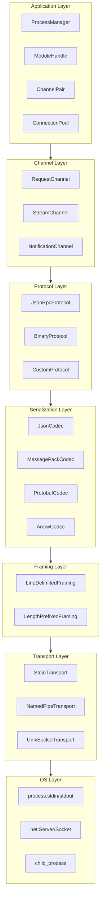
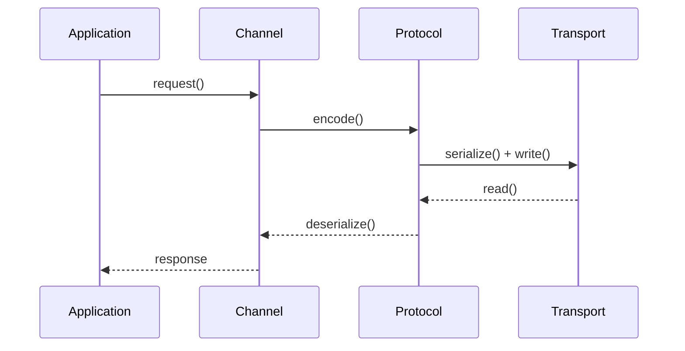
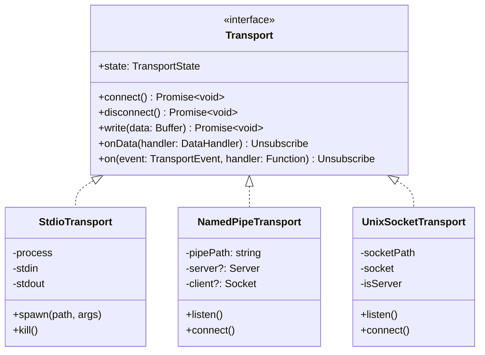
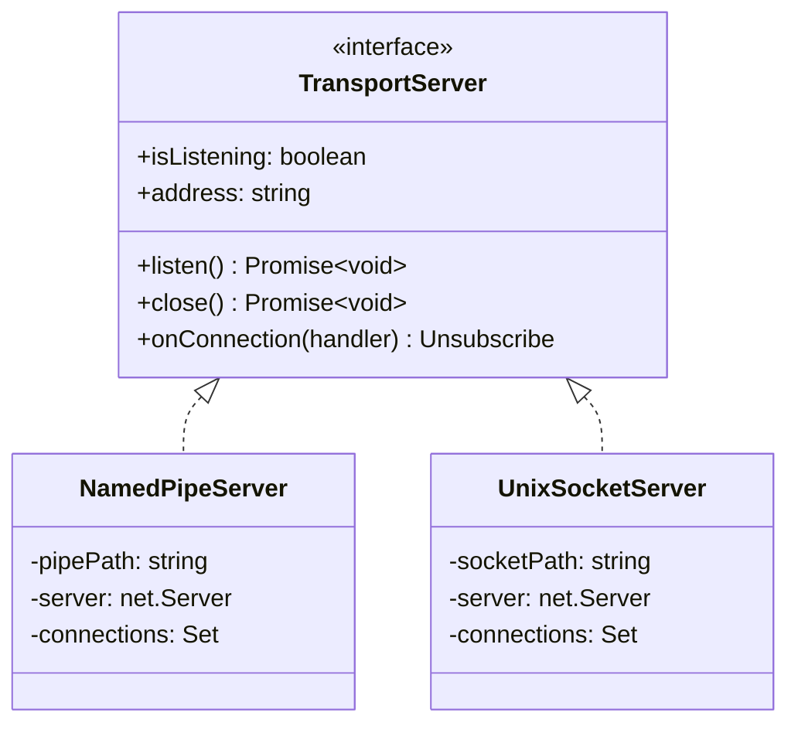
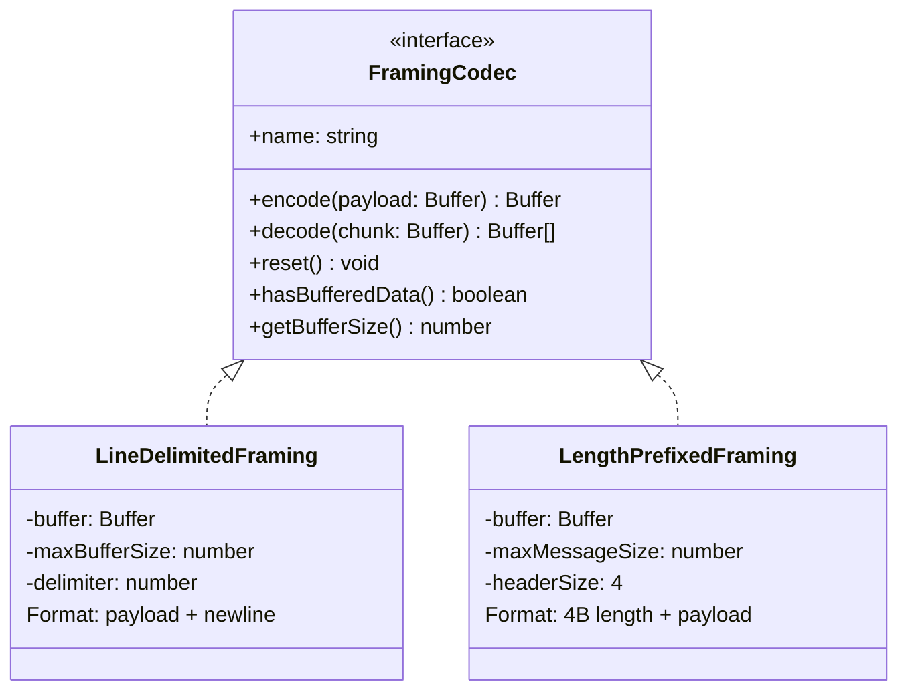
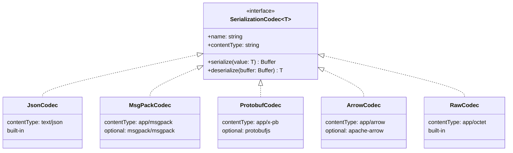
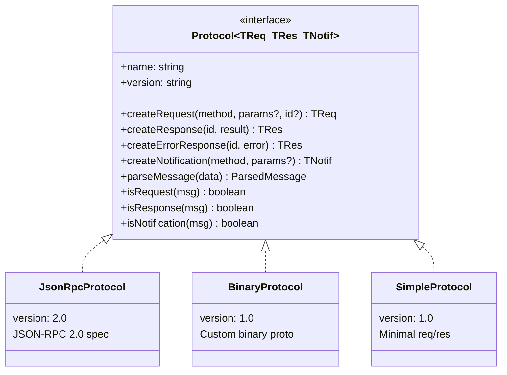
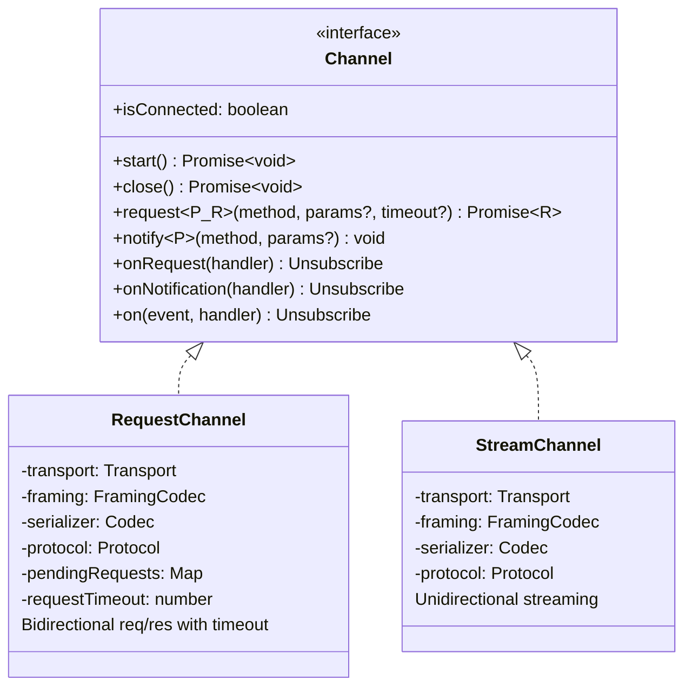
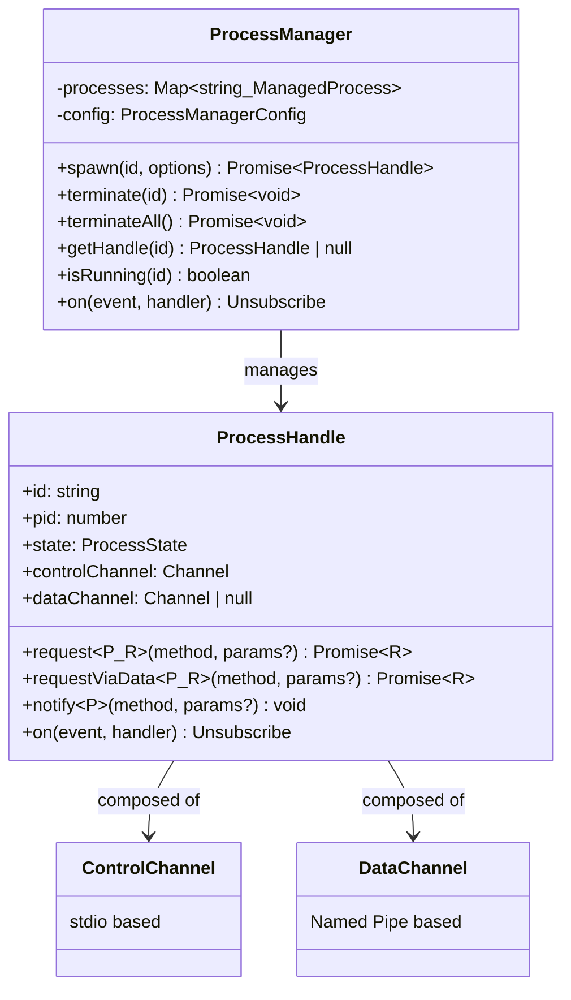

import { Tabs, TabItem } from '@astrojs/starlight/components';

# @procwire/transport

**Standalone IPC Transport Library for Node.js**

A high-performance, protocol-agnostic Inter-Process Communication library for Node.js applications. Designed for scenarios requiring communication between parent and child processes, or between separate Node.js applications via Named Pipes / Unix Domain Sockets.

## Overview

### What is @procwire/transport?

A modular library providing building blocks for high-performance IPC in Node.js:

- **Multiple transports**: stdio, Named Pipes, Unix Domain Sockets
- **Pluggable protocols**: JSON-RPC 2.0, custom binary protocols
- **Pluggable serialization**: JSON, MessagePack, Protocol Buffers, Arrow IPC
- **Process management**: Child process lifecycle with crash recovery
- **TypeScript-first**: Full type safety with generics

### Primary Use Cases

1. **Electron apps** - Main ↔ Helper process communication
2. **Microservices** - Local service mesh without network overhead
3. **Worker processes** - Offloading CPU-intensive tasks
4. **Plugin systems** - Sandboxed plugin execution
5. **Language bridges** - Node.js ↔ Rust/Go/Python communication

## Design Goals

### Core Principles

| Principle             | Description                                            |
| --------------------- | ------------------------------------------------------ |
| **Modularity**        | Each layer is independent and replaceable              |
| **Zero dependencies** | Core has no runtime dependencies (codecs are optional) |
| **Performance**       | Buffer-native operations, zero-copy where possible     |
| **Type safety**       | Full TypeScript support with generics                  |
| **Extensibility**     | Easy to add custom transports, protocols, serializers  |
| **Cross-platform**    | Windows, macOS, Linux support                          |

### Non-Goals

- Network protocols (TCP, HTTP, WebSocket) - use existing solutions
- Encryption/authentication - out of scope, use at transport level if needed
- Service discovery - not a service mesh
- Message queuing - not a message broker

## Architecture

### Layered Architecture



### Data Flow



## Core Concepts

### Transport

The lowest level abstraction. Handles raw byte transfer between endpoints.

```typescript
interface Transport {
  readonly state: TransportState;

  connect(): Promise<void>;
  disconnect(): Promise<void>;

  write(data: Buffer): Promise<void>;
  onData(handler: (data: Buffer) => void): Unsubscribe;

  on(event: TransportEvent, handler: Function): Unsubscribe;
}

type TransportState = 'disconnected' | 'connecting' | 'connected' | 'error';
type TransportEvent = 'connect' | 'disconnect' | 'error' | 'data';
```

### Framing

Message boundary detection in a byte stream.

```typescript
interface FramingCodec {
  readonly name: string;

  encode(payload: Buffer): Buffer;
  decode(chunk: Buffer): Buffer[];  // Returns complete frames

  reset(): void;
  hasBufferedData(): boolean;
}
```

### Serialization

Converts between application objects and binary representation.

```typescript
interface SerializationCodec<T = unknown> {
  readonly name: string;
  readonly contentType: string;

  serialize(value: T): Buffer;
  deserialize(buffer: Buffer): T;
}
```

### Protocol

Application-level message protocol (request/response, notifications, etc.).

```typescript
interface Protocol<TRequest, TResponse, TNotification> {
  readonly name: string;
  readonly version: string;

  createRequest(method: string, params?: unknown, id?: RequestId): TRequest;
  createResponse(id: RequestId, result: unknown): TResponse;
  createErrorResponse(id: RequestId, error: ProtocolError): TResponse;
  createNotification(method: string, params?: unknown): TNotification;

  parseMessage(data: unknown): ParsedMessage;
  isRequest(msg: unknown): msg is TRequest;
  isResponse(msg: unknown): msg is TResponse;
  isNotification(msg: unknown): msg is TNotification;
}
```

### Channel

High-level communication abstraction combining transport + framing + serialization + protocol.

```typescript
interface Channel<TRequest = unknown, TResponse = unknown> {
  readonly isConnected: boolean;

  start(): Promise<void>;
  close(): Promise<void>;

  request<TParams, TResult>(method: string, params?: TParams): Promise<TResult>;
  notify<TParams>(method: string, params?: TParams): void;

  onRequest(handler: RequestHandler): Unsubscribe;
  onNotification(handler: NotificationHandler): Unsubscribe;
}
```

## Class Diagrams

### Transport Layer



### Transport Server



### Framing Layer



### Serialization Layer



### Protocol Layer



### Channel Layer



### Application Layer



## Protocol Layer

### JSON-RPC 2.0 Protocol

Built-in implementation following the [JSON-RPC 2.0 specification](https://www.jsonrpc.org/specification).

```typescript
// Message types
interface JsonRpcRequest {
  jsonrpc: '2.0';
  id: string | number;
  method: string;
  params?: unknown;
}

interface JsonRpcResponse {
  jsonrpc: '2.0';
  id: string | number;
  result?: unknown;
  error?: JsonRpcError;
}

interface JsonRpcNotification {
  jsonrpc: '2.0';
  method: string;
  params?: unknown;
}

interface JsonRpcError {
  code: number;
  message: string;
  data?: unknown;
}

// Standard error codes
const JsonRpcErrorCodes = {
  PARSE_ERROR: -32700,
  INVALID_REQUEST: -32600,
  METHOD_NOT_FOUND: -32601,
  INVALID_PARAMS: -32602,
  INTERNAL_ERROR: -32603,
  // Server errors: -32000 to -32099 (reserved for implementation)
};
```

### Custom Protocol Interface

For implementing custom protocols:

```typescript
interface CustomProtocol<TReq, TRes, TNotif> extends Protocol<TReq, TRes, TNotif> {
  // Protocol-specific methods
  encodeRequest(request: TReq): Buffer;
  decodeRequest(buffer: Buffer): TReq;
  encodeResponse(response: TRes): Buffer;
  decodeResponse(buffer: Buffer): TRes;
}
```

## Transport Layer

### Stdio Transport

For parent ↔ child process communication.

```typescript
interface StdioTransportOptions {
  /** Path to executable */
  executablePath: string;

  /** Command line arguments */
  args?: string[];

  /** Working directory */
  cwd?: string;

  /** Environment variables */
  env?: Record<string, string>;

  /** Startup timeout in ms */
  startupTimeout?: number;

  /** Max stdout buffer size */
  maxStdoutBuffer?: number;

  /** Max stderr buffer size */
  maxStderrBuffer?: number;
}

// Events specific to stdio
interface StdioTransportEvents extends TransportEvents {
  stderr: (line: string) => void;
  exit: (code: number | null, signal: string | null) => void;
}
```

### Named Pipe / Unix Socket Transport

For high-throughput communication between processes.

```typescript
interface PipeTransportOptions {
  /** Pipe/socket path */
  path: string;

  /** Connection timeout in ms */
  connectionTimeout?: number;

  /** Auto-reconnect on disconnect */
  autoReconnect?: boolean;

  /** Initial reconnect delay */
  reconnectDelay?: number;

  /** Max reconnect delay (for exponential backoff) */
  maxReconnectDelay?: number;
}

// Path resolution utility
class PipePath {
  static forModule(namespace: string, moduleId: string): string;
  static isWindows(): boolean;
  static cleanup(path: string): Promise<void>;  // Remove stale Unix sockets
}
```

### Transport Factory

```typescript
class TransportFactory {
  static createStdio(options: StdioTransportOptions): StdioTransport;
  static createPipeClient(options: PipeTransportOptions): PipeClientTransport;
  static createPipeServer(options: PipeServerOptions): PipeServerTransport;

  // Auto-detect best transport for platform
  static createOptimal(options: TransportOptions): Transport;
}
```

## Serialization Layer

### Built-in Codecs

#### JSON Codec (zero dependencies)

```typescript
class JsonCodec implements SerializationCodec {
  readonly name = 'json';
  readonly contentType = 'application/json';

  constructor(options?: {
    replacer?: (key: string, value: unknown) => unknown;
    reviver?: (key: string, value: unknown) => unknown;
  });
}
```

#### Raw Codec (passthrough)

```typescript
class RawCodec implements SerializationCodec<Buffer> {
  readonly name = 'raw';
  readonly contentType = 'application/octet-stream';

  serialize(value: Buffer): Buffer;  // passthrough
  deserialize(buffer: Buffer): Buffer;  // passthrough
}
```

### Optional Codecs (peer dependencies)

#### MessagePack Codec

```typescript
// Requires: @msgpack/msgpack
class MessagePackCodec implements SerializationCodec {
  readonly name = 'msgpack';
  readonly contentType = 'application/x-msgpack';

  constructor(options?: MsgPackOptions);
}
```

#### Protocol Buffers Codec

```typescript
// Requires: protobufjs
class ProtobufCodec<T> implements SerializationCodec<T> {
  readonly name = 'protobuf';
  readonly contentType = 'application/x-protobuf';

  constructor(messageType: protobuf.Type);
}
```

#### Arrow IPC Codec

```typescript
// Requires: apache-arrow
class ArrowCodec implements SerializationCodec<Table> {
  readonly name = 'arrow';
  readonly contentType = 'application/vnd.apache.arrow.stream';

  constructor(schema?: Schema);
}
```

### Codec Registry

```typescript
class CodecRegistry {
  static register(codec: SerializationCodec): void;
  static get(name: string): SerializationCodec | undefined;
  static getByContentType(contentType: string): SerializationCodec | undefined;
  static list(): string[];
}
```

## High-Level API

### Channel Builder (Fluent API)

```typescript
const channel = ChannelBuilder
  .withTransport(new StdioTransport({ executablePath: './worker' }))
  .withFraming(new LengthPrefixedFraming())
  .withSerialization(new MessagePackCodec())
  .withProtocol(new JsonRpcProtocol())
  .withTimeout(30000)
  .build();

await channel.start();
const result = await channel.request('compute', { data: [...] });
await channel.close();
```

### Process Manager

```typescript
const manager = new ProcessManager({
  defaultTimeout: 30000,
  restartPolicy: {
    enabled: true,
    maxRestarts: 3,
    backoffMs: 1000,
  },
});

// Spawn with dual-channel
const handle = await manager.spawn('worker-1', {
  executablePath: './worker',
  controlChannel: {
    framing: 'line-delimited',
    serialization: 'json',
    protocol: 'jsonrpc',
  },
  dataChannel: {
    transport: 'pipe',
    framing: 'length-prefixed',
    serialization: 'msgpack',
  },
});

// Use appropriate channel
const status = await handle.request('status');  // via control
const result = await handle.requestViaData('process', largeData);  // via data

await manager.terminateAll();
```

### Quick Start Functions

```typescript
// Simplest possible setup
import { createStdioChannel, createPipeChannel } from '@procwire/transport';

// Stdio with JSON-RPC (for simple child process)
const channel = await createStdioChannel('./worker');
const result = await channel.request('hello', { name: 'World' });

// Named Pipe with MessagePack (for high-throughput)
const dataChannel = await createPipeChannel('/tmp/my-app.sock', {
  serialization: 'msgpack',
});
await dataChannel.request('bulkInsert', { items: [...] });
```

## Extension Points

### Custom Transport

```typescript
import { Transport, TransportState } from '@procwire/transport';

class WebSocketTransport implements Transport {
  private ws: WebSocket | null = null;
  private _state: TransportState = 'disconnected';

  get state() { return this._state; }

  async connect(): Promise<void> {
    this.ws = new WebSocket(this.url);
    await this.waitForOpen();
    this._state = 'connected';
  }

  async disconnect(): Promise<void> {
    this.ws?.close();
    this._state = 'disconnected';
  }

  async write(data: Buffer): Promise<void> {
    this.ws?.send(data);
  }

  onData(handler: (data: Buffer) => void): Unsubscribe {
    const listener = (event: MessageEvent) => handler(Buffer.from(event.data));
    this.ws?.addEventListener('message', listener);
    return () => this.ws?.removeEventListener('message', listener);
  }
}
```

### Custom Serialization

```typescript
import { SerializationCodec } from '@procwire/transport';
import cbor from 'cbor';

class CborCodec implements SerializationCodec {
  readonly name = 'cbor';
  readonly contentType = 'application/cbor';

  serialize(value: unknown): Buffer {
    return cbor.encode(value);
  }

  deserialize(buffer: Buffer): unknown {
    return cbor.decode(buffer);
  }
}

// Register for use with ChannelBuilder
CodecRegistry.register(new CborCodec());
```

### Custom Protocol

```typescript
import { Protocol, ParsedMessage } from '@procwire/transport';

interface MyRequest { type: 'request'; id: number; action: string; payload: unknown }
interface MyResponse { type: 'response'; id: number; data: unknown; error?: string }
interface MyNotification { type: 'event'; name: string; payload: unknown }

class MyProtocol implements Protocol<MyRequest, MyResponse, MyNotification> {
  readonly name = 'my-protocol';
  readonly version = '1.0';

  createRequest(method: string, params?: unknown, id?: number): MyRequest {
    return { type: 'request', id: id ?? Date.now(), action: method, payload: params };
  }

  // ... implement other methods
}
```

### Middleware

```typescript
interface ChannelMiddleware {
  onOutgoingRequest?(request: unknown): unknown | Promise<unknown>;
  onIncomingResponse?(response: unknown): unknown | Promise<unknown>;
  onIncomingRequest?(request: unknown): unknown | Promise<unknown>;
  onOutgoingResponse?(response: unknown): unknown | Promise<unknown>;
  onError?(error: Error): void;
}

// Example: Logging middleware
const loggingMiddleware: ChannelMiddleware = {
  onOutgoingRequest(req) {
    console.log('→', req);
    return req;
  },
  onIncomingResponse(res) {
    console.log('←', res);
    return res;
  },
};

const channel = ChannelBuilder
  .withTransport(transport)
  .withMiddleware(loggingMiddleware)
  .build();
```

## Package Structure

### Monorepo Structure

```
@procwire/
├── transport/                 # Core package (zero dependencies)
│   ├── src/
│   │   ├── index.ts          # Public API exports
│   │   ├── transport/        # Transport implementations
│   │   │   ├── types.ts
│   │   │   ├── stdio.ts
│   │   │   ├── pipe-client.ts
│   │   │   ├── pipe-server.ts
│   │   │   └── factory.ts
│   │   ├── framing/          # Framing codecs
│   │   │   ├── types.ts
│   │   │   ├── line-delimited.ts
│   │   │   └── length-prefixed.ts
│   │   ├── serialization/    # Built-in codecs
│   │   │   ├── types.ts
│   │   │   ├── json.ts
│   │   │   ├── raw.ts
│   │   │   └── registry.ts
│   │   ├── protocol/         # Protocol implementations
│   │   │   ├── types.ts
│   │   │   ├── jsonrpc.ts
│   │   │   └── simple.ts
│   │   ├── channel/          # High-level channels
│   │   │   ├── types.ts
│   │   │   ├── request-channel.ts
│   │   │   ├── stream-channel.ts
│   │   │   └── builder.ts
│   │   ├── process/          # Process management
│   │   │   ├── types.ts
│   │   │   ├── manager.ts
│   │   │   └── handle.ts
│   │   └── utils/            # Utilities
│   │       ├── pipe-path.ts
│   │       ├── events.ts
│   │       └── errors.ts
│   ├── package.json
│   └── tsconfig.json
│
├── codec-msgpack/            # MessagePack codec
│   ├── src/index.ts
│   └── package.json          # peerDep: @msgpack/msgpack
│
├── codec-protobuf/           # Protobuf codec
│   ├── src/index.ts
│   └── package.json          # peerDep: protobufjs
│
├── codec-arrow/              # Arrow IPC codec
│   ├── src/index.ts
│   └── package.json          # peerDep: apache-arrow
│
└── examples/                 # Example applications
    ├── basic-stdio/
    ├── dual-channel/
    └── rust-worker/
```

### Package Exports

```json
// @procwire/transport/package.json
{
  "name": "@procwire/transport",
  "version": "0.1.0",
  "exports": {
    ".": "./dist/index.js",
    "./transport": "./dist/transport/index.js",
    "./framing": "./dist/framing/index.js",
    "./serialization": "./dist/serialization/index.js",
    "./protocol": "./dist/protocol/index.js",
    "./channel": "./dist/channel/index.js",
    "./process": "./dist/process/index.js"
  },
  "peerDependencies": {},
  "devDependencies": {
    "typescript": "^5.0.0",
    "vitest": "^1.0.0"
  }
}
```

## Dependencies

### Core Package (zero runtime dependencies)

| Dependency    | Type | Purpose           |
| ------------- | ---- | ----------------- |
| TypeScript    | dev  | Type definitions  |
| Vitest        | dev  | Testing           |
| Node.js types | dev  | Node.js API types |

### Optional Codec Packages

| Package                  | Peer Dependency  | Version |
| ------------------------ | ---------------- | ------- |
| @procwire/codec-msgpack  | @msgpack/msgpack | ^3.0.0  |
| @procwire/codec-protobuf | protobufjs       | ^7.0.0  |
| @procwire/codec-arrow    | apache-arrow     | ^15.0.0 |

### Node.js Requirements

- **Minimum**: Node.js 18.x (LTS)
- **Recommended**: Node.js 20.x or later
- **Platform**: Windows, macOS, Linux

## Usage Examples

### Basic Stdio Communication

```typescript
import { createStdioChannel } from '@procwire/transport';

async function main() {
  // Start worker process with JSON-RPC channel
  const channel = await createStdioChannel('./worker.js');

  // Request/response
  const result = await channel.request('add', { a: 1, b: 2 });
  console.log('Result:', result); // { sum: 3 }

  // Notifications
  channel.notify('log', { message: 'Hello from parent' });

  // Handle incoming notifications
  channel.onNotification((notif) => {
    console.log('Worker says:', notif.method, notif.params);
  });

  await channel.close();
}
```

### Dual-Channel Setup

```typescript
import { ProcessManager, MessagePackCodec } from '@procwire/transport';

async function main() {
  const manager = new ProcessManager();

  const handle = await manager.spawn('worker', {
    executablePath: './worker',
    dataChannel: {
      enabled: true,
      transport: 'pipe',
      serialization: new MessagePackCodec(),
    },
  });

  // Small requests via control channel (JSON-RPC/stdio)
  const status = await handle.request('getStatus');

  // Bulk data via data channel (MessagePack/pipe)
  const items = generateLargeDataset();
  const result = await handle.requestViaData('processItems', { items });

  await manager.terminateAll();
}
```

### Server Mode (Multiple Clients)

```typescript
import { PipeServer, RequestChannel, JsonRpcProtocol } from '@procwire/transport';

async function startServer() {
  const server = new PipeServer({ path: '/tmp/my-service.sock' });

  server.onConnection((transport) => {
    const channel = new RequestChannel({
      transport,
      protocol: new JsonRpcProtocol(),
    });

    channel.onRequest(async (method, params) => {
      if (method === 'echo') {
        return params;
      }
      throw new Error('Unknown method');
    });

    channel.start();
  });

  await server.listen();
  console.log('Server listening on', server.address);
}
```

### Rust Worker Integration

<Tabs>
  <TabItem label="Node.js">
```typescript
import { ProcessManager } from '@procwire/transport';

const manager = new ProcessManager();
const handle = await manager.spawn('rust-worker', {
  executablePath: './target/release/my-worker',
});

const result = await handle.request('compute', { data: [...] });
```
  </TabItem>
  <TabItem label="Rust">
```rust
use serde::{Deserialize, Serialize};
use serde_json::{json, Value};
use std::io::{self, BufRead, Write};

#[derive(Deserialize)]
struct JsonRpcRequest {
    jsonrpc: String,
    id: Value,
    method: String,
    params: Option<Value>,
}

#[derive(Serialize)]
struct JsonRpcResponse {
    jsonrpc: String,
    id: Value,
    result: Option<Value>,
    error: Option<Value>,
}

fn main() {
    // Send ready notification
    println!(r#"{{"jsonrpc":"2.0","method":"runtime.ready","params":{{}}}}"#);
    io::stdout().flush().unwrap();

    let stdin = io::stdin();
    for line in stdin.lock().lines() {
        let line = line.unwrap();
        let request: JsonRpcRequest = serde_json::from_str(&line).unwrap();

        let result = match request.method.as_str() {
            "compute" => json!({ "computed": true }),
            _ => json!(null),
        };

        let response = JsonRpcResponse {
            jsonrpc: "2.0".to_string(),
            id: request.id,
            result: Some(result),
            error: None,
        };

        println!("{}", serde_json::to_string(&response).unwrap());
        io::stdout().flush().unwrap();
    }
}
```
  </TabItem>
</Tabs>

## Comparison with Alternatives

| Feature           | @procwire/transport   | node-ipc       | zeromq           | grpc      |
| ----------------- | --------------------- | -------------- | ---------------- | --------- |
| **Transport**     | stdio, pipes, sockets | sockets, pipes | tcp, ipc, inproc | http/2    |
| **Protocol**      | JSON-RPC, custom      | custom         | none (raw)       | protobuf  |
| **Serialization** | pluggable             | JSON           | raw              | protobuf  |
| **Dependencies**  | 0 (core)              | 1              | native           | native    |
| **TypeScript**    | first-class           | partial        | partial          | generated |
| **Process mgmt**  | yes                   | no             | no               | no        |
| **Dual-channel**  | yes                   | no             | no               | no        |
| **Streaming**     | yes                   | partial        | yes              | yes       |
| **Size**          | ~50KB                 | ~20KB          | ~5MB             | ~10MB     |

### When to Use @procwire/transport

✅ **Use when:**
- Building Electron apps with helper processes
- Need pluggable serialization (JSON, MessagePack, Arrow)
- Want process lifecycle management
- Need dual-channel (control + data) architecture
- Prefer zero runtime dependencies
- Want full TypeScript support

❌ **Don't use when:**
- Need network protocols (use gRPC, WebSocket)
- Need message queuing (use RabbitMQ, Redis)
- Need distributed systems (use ZeroMQ, NATS)
- Need schema validation (use gRPC with Protobuf)
