import { Tabs, TabItem } from "@astrojs/starlight/components";

# Procwire Wire Protocol Specification v1.0

**Status:** Draft
**Version:** 1.0.0-draft
**Last Updated:** 2025-01-24
**Authors:** Sebastian (SebastianWebdev)

---

## 1. Overview

### 1.1 Purpose

This document specifies the wire protocol for Procwire IPC (Inter-Process Communication) between a **Manager** (Node.js parent process) and **Workers** (child processes in Rust, Node.js, Python, or other languages).

The protocol is designed for:

- **Long-lived worker processes** (e.g., Rust modules in Electron apps)
- **High-throughput data transfer** (embeddings, images, binary data)
- **Reliability** (heartbeat, reconnection, graceful shutdown)
- **Cross-language compatibility** (language-agnostic wire format)

### 1.2 Design Principles

| Principle                     | Description                                                  |
| ----------------------------- | ------------------------------------------------------------ |
| **Dual-channel architecture** | Separate control (stdio) and data (pipe/socket) channels     |
| **Simplicity**                | JSON-RPC 2.0 based, easy to implement in any language        |
| **Efficiency**                | Binary framing, pluggable serialization (MessagePack, Arrow) |
| **Reliability**               | Heartbeat detection, graceful degradation                    |
| **Backward compatibility**    | Version negotiation in handshake                             |

### 1.3 Terminology

| Term                | Definition                                                   |
| ------------------- | ------------------------------------------------------------ |
| **Manager**         | The parent process (Node.js) that spawns and manages workers |
| **Worker**          | A child process that performs work (Rust, Node.js, Python)   |
| **Control Channel** | stdio-based channel for lightweight commands and lifecycle   |
| **Data Channel**    | pipe/socket-based channel for bulk data transfer             |
| **Frame**           | A delimited unit of data on the wire                         |
| **Message**         | A JSON-RPC 2.0 request, response, or notification            |

### 1.4 Protocol Version

This specification defines **Wire Protocol v1.0**.

Version format: `MAJOR.MINOR`

- **MAJOR**: Incompatible changes (different framing, message format)
- **MINOR**: Backward-compatible additions (new reserved methods)

---

## 2. Architecture

### 2.1 Dual-Channel Model

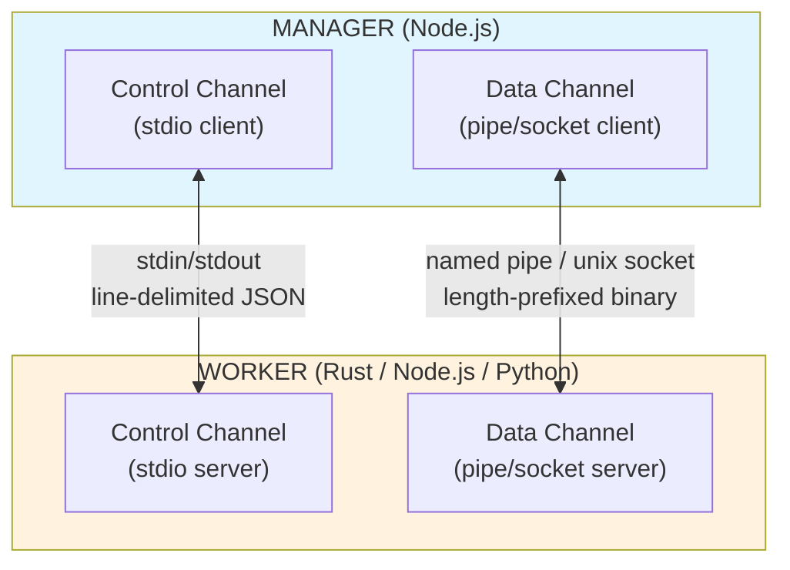

### 2.2 Channel Responsibilities

| Aspect            | Control Channel                         | Data Channel                           |
| ----------------- | --------------------------------------- | -------------------------------------- |
| **Transport**     | stdio (stdin/stdout)                    | Named Pipe (Windows) / Unix Socket     |
| **Direction**     | Bidirectional                           | Bidirectional                          |
| **Framing**       | Line-delimited (`\n`)                   | Length-prefixed (4-byte header)        |
| **Serialization** | JSON                                    | MessagePack / Arrow IPC                |
| **Use cases**     | Handshake, heartbeat, lifecycle, status | Bulk data, embeddings, binary payloads |
| **Latency**       | Low (small messages)                    | Optimized for throughput               |
| **Reliability**   | Always available                        | May reconnect                          |

### 2.3 Channel Establishment

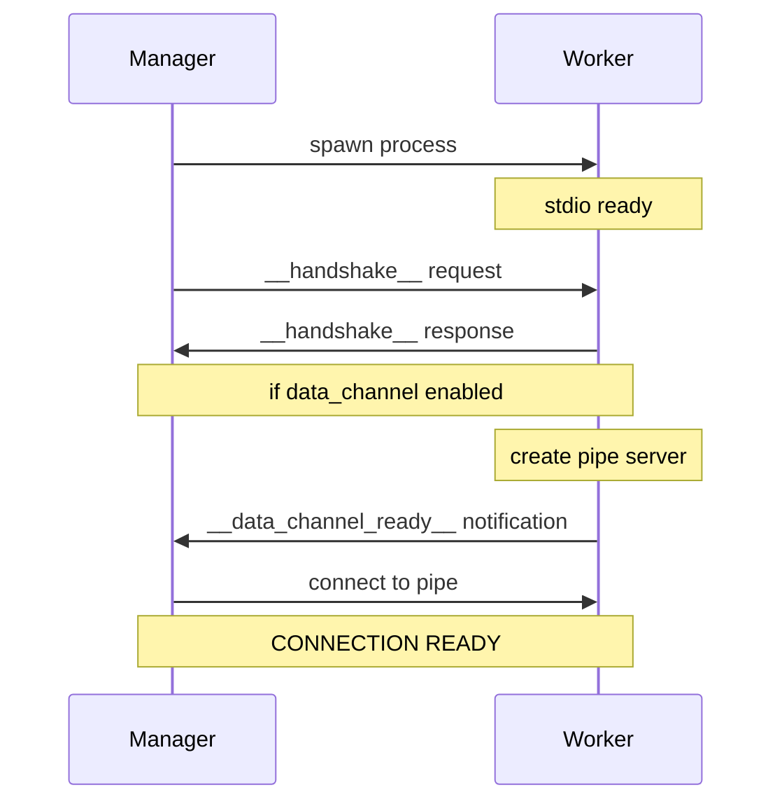

---

## 3. Framing Layer

### 3.1 Control Channel Framing (Line-Delimited)

Messages are UTF-8 encoded JSON objects separated by newline (`0x0A`).

```
[JSON object bytes][0x0A newline]
[JSON object bytes][0x0A newline]
...
```

**Rules:**

- Each message MUST be a single line (no embedded newlines in JSON)
- Messages MUST be valid UTF-8
- Maximum message size: 1 MB (configurable)
- Empty lines SHOULD be ignored

**Example:**

```
{"jsonrpc":"2.0","id":1,"method":"__handshake__","params":{"version":"1.0"}}\n
{"jsonrpc":"2.0","id":1,"result":{"version":"1.0","capabilities":["heartbeat"]}}\n
```

### 3.2 Data Channel Framing (Length-Prefixed)

Messages are prefixed with a 4-byte big-endian unsigned integer indicating payload length.


**Rules:**

- Length field is exactly 4 bytes, big-endian, unsigned
- Length indicates payload size (does NOT include the 4-byte header)
- Maximum payload size: 100 MB (configurable)
- Zero-length payloads are valid (used for keepalive)

**Example (hex):**

```
00 00 00 1A                              # Length: 26 bytes
7B 22 6A 73 6F 6E 72 70 63 22 3A ...    # Payload: {"jsonrpc":...
```

### 3.3 Framing Error Handling

| Error                   | Control Channel          | Data Channel          |
| ----------------------- | ------------------------ | --------------------- |
| Invalid UTF-8           | Close connection         | Close connection      |
| Message too large       | Emit error, skip message | Close connection      |
| Incomplete frame        | Buffer until complete    | Buffer until complete |
| Corrupted length header | N/A                      | Close connection      |

---

## 4. Serialization Layer

### 4.1 Control Channel Serialization

Control Channel MUST use **JSON** serialization.

**Rules:**

- Valid JSON per RFC 8259
- UTF-8 encoding only
- No comments or trailing commas
- Numbers MUST fit in IEEE 754 double precision

### 4.2 Data Channel Serialization

Data Channel supports pluggable serialization, negotiated during handshake.

| Codec           | Content-Type                          | Use Case                                      |
| --------------- | ------------------------------------- | --------------------------------------------- |
| **JSON**        | `application/json`                    | Debugging, compatibility                      |
| **MessagePack** | `application/msgpack`                 | General binary data, 20-50% smaller than JSON |
| **Arrow IPC**   | `application/vnd.apache.arrow.stream` | Columnar data, embeddings, zero-copy          |

**Default:** MessagePack

### 4.3 Hybrid Serialization (Arrow Payloads)

For large binary payloads (embeddings, matrices), messages can use hybrid serialization:

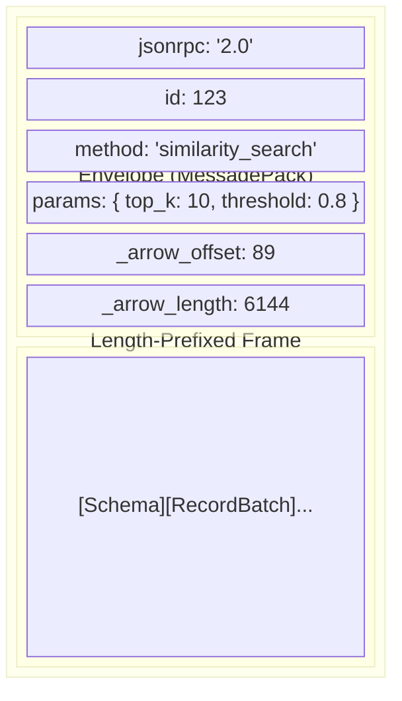

**Rules:**

- `_arrow_offset` and `_arrow_length` are reserved fields
- Arrow payload is appended after MessagePack envelope
- Receiver MUST support hybrid format if `arrow` capability is declared

---

## 5. Message Format

### 5.1 JSON-RPC 2.0 Base

All messages follow JSON-RPC 2.0 specification with extensions.

<Tabs>
  <TabItem label="Request">
```json
{
  "jsonrpc": "2.0",
  "id": "<string | number>",
  "method": "<string>",
  "params": "<any>"
}
```
  </TabItem>
  <TabItem label="Response (success)">
```json
{
  "jsonrpc": "2.0",
  "id": "<string | number>",
  "result": "<any>"
}
```
  </TabItem>
  <TabItem label="Response (error)">
```json
{
  "jsonrpc": "2.0",
  "id": "<string | number>",
  "error": {
    "code": "<number>",
    "message": "<string>",
    "data": "<any>"
  }
}
```
  </TabItem>
  <TabItem label="Notification">
```json
{
  "jsonrpc": "2.0",
  "method": "<string>",
  "params": "<any>"
}
```
  </TabItem>
</Tabs>

### 5.2 Request ID Generation

- IDs MUST be unique within a connection session
- IDs MAY be strings or numbers
- Recommended: incrementing integers or UUIDs
- Manager and Worker maintain separate ID spaces

### 5.3 Method Naming

| Prefix                   | Meaning                  | Example                               |
| ------------------------ | ------------------------ | ------------------------------------- |
| `__` (double underscore) | Reserved protocol method | `__handshake__`, `__heartbeat_ping__` |
| (no prefix)              | User-defined method      | `similarity_search`, `process_image`  |

**Rules:**

- Reserved methods (`__*__`) MUST NOT be used by applications
- Method names are case-sensitive
- Method names SHOULD use `snake_case`

---

## 6. Reserved Methods

All reserved methods start with `__` and end with `__`.

### 6.1 Handshake

#### `__handshake__` (Request)

**Direction:** Manager → Worker
**Channel:** Control
**Purpose:** Initialize connection, negotiate capabilities

<Tabs>
  <TabItem label="Request params">
```json
{
  "version": "1.0",
  "capabilities": ["heartbeat", "data_channel", "streaming", "arrow"],
  "data_channel": {
    "path": "/tmp/procwire-worker-1.sock",
    "serialization": "msgpack"
  }
}
```
  </TabItem>
  <TabItem label="Response result">
```json
{
  "version": "1.0",
  "capabilities": ["heartbeat", "data_channel", "arrow"],
  "worker_info": {
    "name": "vector-db",
    "language": "rust",
    "pid": 12345
  }
}
```
  </TabItem>
</Tabs>

**Capability tokens:**

| Token          | Description                           |
| -------------- | ------------------------------------- |
| `heartbeat`    | Supports heartbeat ping/pong          |
| `data_channel` | Supports secondary data channel       |
| `streaming`    | Supports stream protocol              |
| `arrow`        | Supports Arrow IPC payloads           |
| `compression`  | Supports payload compression (future) |

### 6.2 Heartbeat

#### `__heartbeat_ping__` (Notification)

**Direction:** Manager → Worker
**Channel:** Control
**Purpose:** Check if worker is alive

```json
{
  "timestamp": 1706100000000,
  "seq": 42
}
```

#### `__heartbeat_pong__` (Notification)

**Direction:** Worker → Manager
**Channel:** Control
**Purpose:** Respond to ping

```json
{
  "timestamp": 1706100000000,
  "seq": 42,
  "load": {
    "cpu_percent": 45.2,
    "memory_mb": 128
  }
}
```

### 6.3 Data Channel Lifecycle

#### `__data_channel_ready__` (Notification)

**Direction:** Worker → Manager
**Channel:** Control
**Purpose:** Signal that data channel server is listening

```json
{
  "path": "/tmp/procwire-worker-1.sock"
}
```

#### `__data_channel_error__` (Notification)

**Direction:** Worker → Manager
**Channel:** Control
**Purpose:** Report data channel error

```json
{
  "error": "EADDRINUSE",
  "message": "Address already in use",
  "path": "/tmp/procwire-worker-1.sock"
}
```

### 6.4 Shutdown

#### `__shutdown__` (Request)

**Direction:** Manager → Worker
**Channel:** Control
**Purpose:** Request graceful shutdown

<Tabs>
  <TabItem label="Request params">
```json
{
  "timeout_ms": 5000,
  "reason": "user_requested"
}
```
  </TabItem>
  <TabItem label="Response result">
```json
{
  "status": "shutting_down",
  "pending_requests": 3
}
```
  </TabItem>
</Tabs>

**Shutdown reasons:**

| Reason             | Description              |
| ------------------ | ------------------------ |
| `user_requested`   | User initiated shutdown  |
| `manager_shutdown` | Manager is shutting down |
| `idle_timeout`     | Worker idle for too long |
| `error_threshold`  | Too many errors          |
| `restart`          | Worker will be restarted |

#### `__shutdown_complete__` (Notification)

**Direction:** Worker → Manager
**Channel:** Control
**Purpose:** Confirm shutdown complete (sent just before exit)

```json
{
  "exit_code": 0
}
```

### 6.5 Credit-Based Flow Control

#### `__credit_grant__` (Notification)

**Direction:** Consumer → Producer
**Channel:** Data
**Purpose:** Grant permission to send N frames

```json
{
  "stream_id": "stream-123",
  "credits": 100
}
```

#### `__credit_exhausted__` (Notification)

**Direction:** Producer → Consumer
**Channel:** Data
**Purpose:** Notify that producer is waiting for credits

```json
{
  "stream_id": "stream-123",
  "pending_frames": 50
}
```

### 6.6 Stream Lifecycle

#### `__stream_open__` (Request)

**Direction:** Initiator → Receiver
**Channel:** Control
**Purpose:** Open a new stream

<Tabs>
  <TabItem label="Request params">
```json
{
  "stream_id": "stream-123",
  "method": "bulk_insert",
  "direction": "push",
  "params": {
    "collection": "embeddings",
    "expected_count": 10000
  },
  "initial_credits": 100
}
```
  </TabItem>
  <TabItem label="Response result">
```json
{
  "stream_id": "stream-123",
  "accepted": true,
  "initial_credits": 100
}
```
  </TabItem>
</Tabs>

**Direction values:**

| Value  | Meaning                                    |
| ------ | ------------------------------------------ |
| `push` | Initiator sends data, receiver consumes    |
| `pull` | Initiator receives data, receiver produces |

#### `__stream_data__` (Notification)

**Direction:** Producer → Consumer
**Channel:** Data
**Purpose:** Send stream data frame

<Tabs>
  <TabItem label="Standard">
```json
{
  "stream_id": "stream-123",
  "seq": 42,
  "payload": "<binary data or object>"
}
```
  </TabItem>
  <TabItem label="With Arrow">
```json
{
  "stream_id": "stream-123",
  "seq": 42,
  "_arrow_offset": 67,
  "_arrow_length": 4096
}
```
  </TabItem>
</Tabs>

#### `__stream_end__` (Notification)

**Direction:** Producer → Consumer
**Channel:** Data
**Purpose:** Signal end of stream

```json
{
  "stream_id": "stream-123",
  "final_seq": 9999,
  "checksum": "sha256:abc123..."
}
```

#### `__stream_close__` (Request)

**Direction:** Either → Either
**Channel:** Control
**Purpose:** Close stream and get final result

<Tabs>
  <TabItem label="Request params">
```json
{
  "stream_id": "stream-123"
}
```
  </TabItem>
  <TabItem label="Response result">
```json
{
  "stream_id": "stream-123",
  "frames_sent": 10000,
  "frames_received": 10000,
  "result": {
    "inserted": 10000,
    "time_ms": 1234
  }
}
```
  </TabItem>
</Tabs>

#### `__stream_abort__` (Notification)

**Direction:** Either → Either
**Channel:** Control
**Purpose:** Abort stream due to error

```json
{
  "stream_id": "stream-123",
  "reason": "timeout",
  "message": "Stream idle for 30s"
}
```

---

## 7. Connection Lifecycle

### 7.1 State Machine

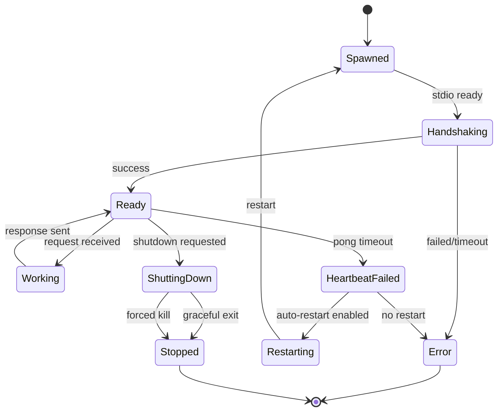

### 7.2 Handshake Sequence

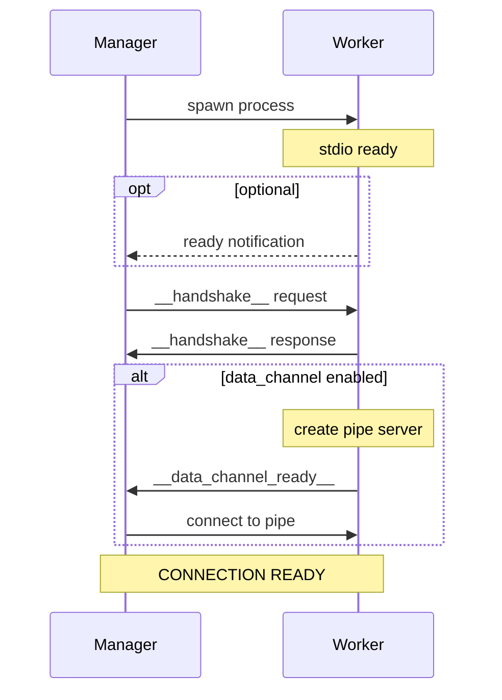

### 7.3 Graceful Shutdown Sequence

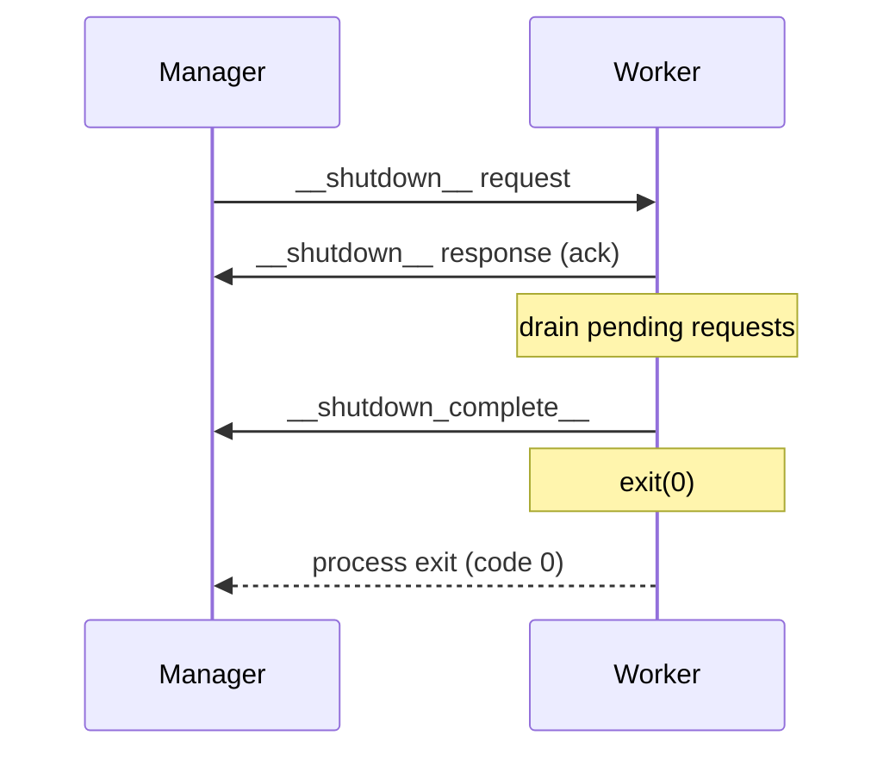

### 7.4 Forced Shutdown

If worker doesn't respond to `__shutdown__` within timeout:

1. Manager sends SIGTERM
2. Wait `gracefulShutdownMs` (default: 5000ms)
3. If still alive, send SIGKILL
4. Clean up resources

---

## 8. Heartbeat Protocol

### 8.1 Overview

Heartbeat detects unresponsive workers (deadlock, infinite loop, resource exhaustion).

**Parameters:**

| Parameter   | Default | Description                        |
| ----------- | ------- | ---------------------------------- |
| `interval`  | 30000ms | Time between pings                 |
| `timeout`   | 5000ms  | Max time to wait for pong          |
| `maxMissed` | 3       | Missed pongs before declaring dead |

### 8.2 Heartbeat Sequence

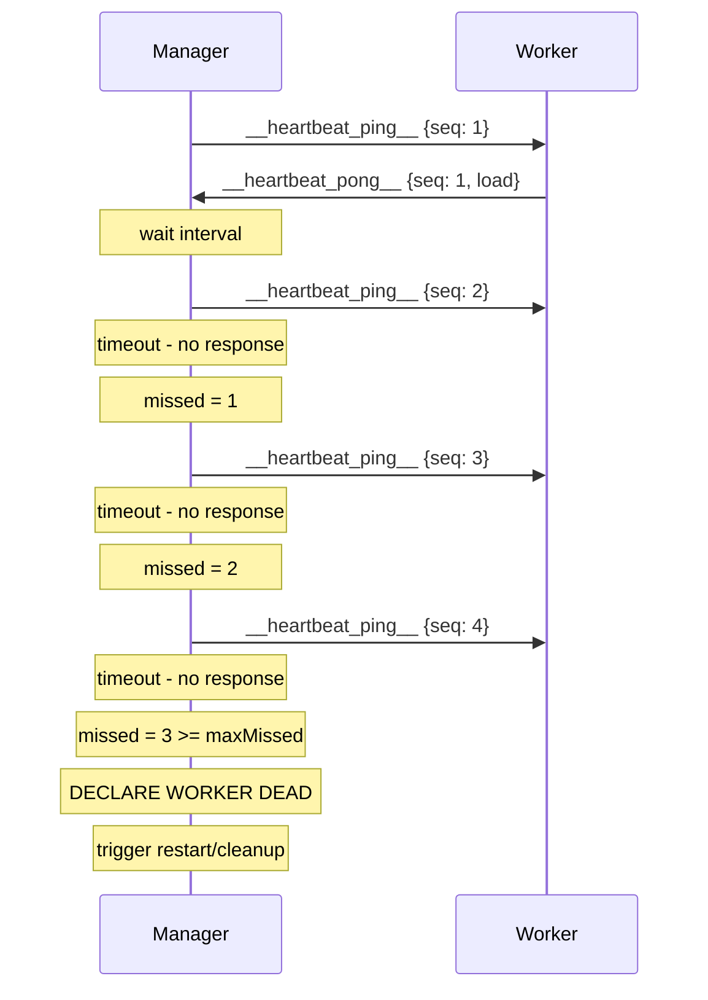

### 8.3 Implicit Heartbeat

Active request/response on ANY channel counts as implicit heartbeat:

- Reset missed counter on any successful response
- Don't send ping if request is in-flight

### 8.4 Worker Load Reporting

Pong MAY include optional load metrics:

```json
{
  "timestamp": 1706100000000,
  "seq": 42,
  "load": {
    "cpu_percent": 45.2,
    "memory_mb": 128,
    "pending_requests": 5,
    "custom": {
      "vectors_indexed": 1000000,
      "cache_hit_rate": 0.95
    }
  }
}
```

---

## 9. Stream Protocol

### 9.1 Overview

Streams enable efficient transfer of large datasets that don't fit in single request.

**Characteristics:**

- **Simplex**: Unidirectional data flow (push or pull)
- **Credit-based**: Backpressure via credit grants
- **Ordered**: Frames have sequence numbers
- **Reliable**: Built on reliable transport

### 9.2 Credit-Based Flow Control

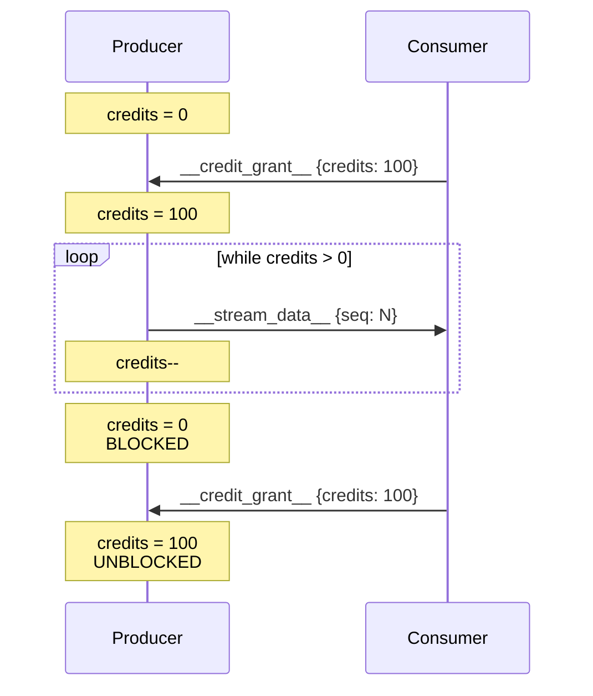

**Credit model: 1 credit = 1 frame**

### 9.3 Stream Lifecycle

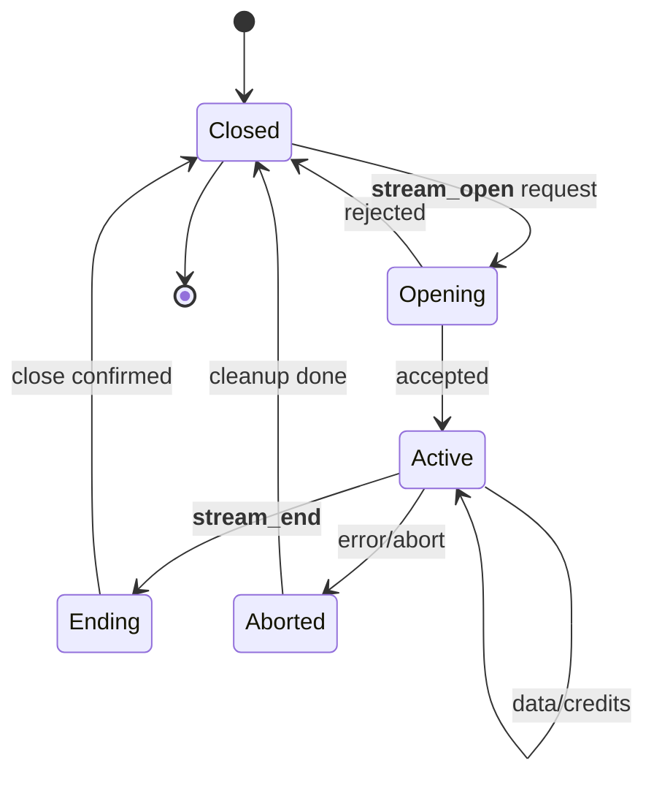

### 9.4 Bulk Insert Example (Push Stream)

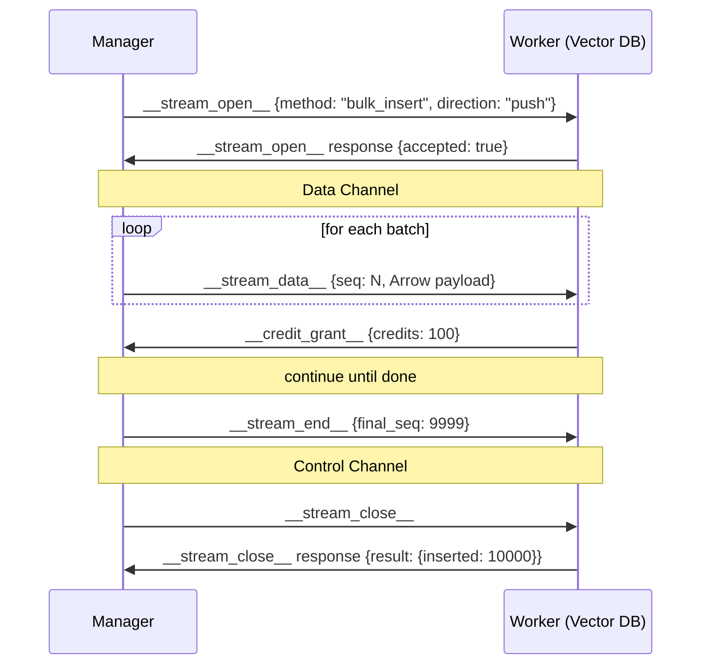

### 9.5 Query Results Example (Pull Stream)

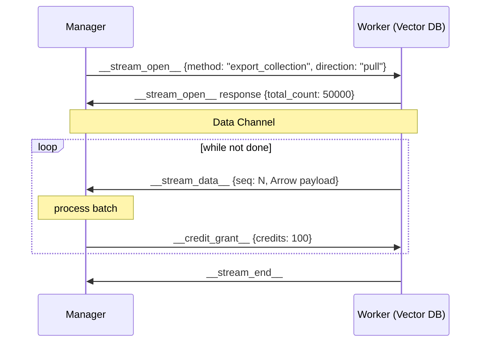

---

## 10. Error Handling

### 10.1 Error Codes

Based on JSON-RPC 2.0 with extensions:

| Code   | Name                 | Description                   |
| ------ | -------------------- | ----------------------------- |
| -32700 | Parse error          | Invalid JSON                  |
| -32600 | Invalid Request      | Not a valid Request object    |
| -32601 | Method not found     | Method does not exist         |
| -32602 | Invalid params       | Invalid method parameters     |
| -32603 | Internal error       | Internal JSON-RPC error       |
| -32000 | Server error         | Generic server error          |
| -32001 | Timeout              | Request timed out             |
| -32002 | Cancelled            | Request was cancelled         |
| -32010 | Stream error         | Stream-related error          |
| -32011 | Stream not found     | Unknown stream ID             |
| -32012 | Stream aborted       | Stream was aborted            |
| -32020 | Channel error        | Channel-related error         |
| -32021 | Channel not ready    | Data channel not established  |
| -32030 | Handshake error      | Handshake failed              |
| -32031 | Version mismatch     | Protocol version incompatible |
| -32040 | Heartbeat timeout    | Heartbeat pong not received   |
| -32050 | Shutdown in progress | Worker is shutting down       |

### 10.2 Error Response Format

```json
{
  "jsonrpc": "2.0",
  "id": 123,
  "error": {
    "code": -32001,
    "message": "Request timed out after 30000ms",
    "data": {
      "method": "similarity_search",
      "timeout_ms": 30000,
      "elapsed_ms": 30001
    }
  }
}
```

### 10.3 Fatal vs Recoverable Errors

| Error Type            | Action                                  |
| --------------------- | --------------------------------------- |
| Parse error (control) | Close connection                        |
| Parse error (data)    | Close data channel, notify via control  |
| Method not found      | Return error response                   |
| Timeout               | Return error response, optionally retry |
| Heartbeat timeout     | Declare dead, trigger restart           |
| Stream error          | Abort stream, continue connection       |

---

## 11. Security Considerations

### 11.1 Trust Model

- Manager and Worker run on same machine
- Communication is local (stdio, named pipes, unix sockets)
- No encryption by default (not needed for local IPC)
- Trust is established by process spawn (Manager spawns Worker)

### 11.2 Input Validation

**Workers MUST:**

- Validate all input parameters
- Enforce size limits on payloads
- Sanitize any data used in system calls
- Handle malformed messages gracefully

**Managers MUST:**

- Validate worker responses
- Enforce timeouts
- Handle worker crashes gracefully

### 11.3 Resource Limits

| Resource                   | Recommended Limit |
| -------------------------- | ----------------- |
| Max message size (control) | 1 MB              |
| Max message size (data)    | 100 MB            |
| Max concurrent streams     | 100               |
| Max pending requests       | 1000              |
| Request timeout            | 30 seconds        |
| Stream idle timeout        | 60 seconds        |

---

## 12. Implementation Notes

### 12.1 Node.js (Manager)

```typescript
// Recommended implementation approach
interface ProcwireManager {
  spawn(options: SpawnOptions): Promise<WorkerHandle>;

  // Control channel is always stdio
  // Data channel is optional named pipe
}

interface WorkerHandle {
  // Request/response via control or data
  request(method: string, params?: unknown): Promise<unknown>;
  requestViaData(method: string, params?: unknown): Promise<unknown>;

  // Streaming via data channel
  openStream(method: string, options: StreamOptions): Promise<Stream>;

  // Lifecycle
  shutdown(timeout?: number): Promise<void>;
}
```

### 12.2 Rust (Worker)

```rust
// Recommended implementation approach
pub trait ProcwireWorker {
    // Called after handshake
    fn on_ready(&mut self);

    // Handle requests
    fn handle_request(&mut self, method: &str, params: Value) -> Result<Value>;

    // Handle stream open
    fn handle_stream_open(&mut self, stream_id: &str, method: &str, params: Value)
        -> Result<StreamHandler>;

    // Called on shutdown request
    fn on_shutdown(&mut self, reason: &str);
}

// Macro for easy handler registration
#[procwire::handler]
fn similarity_search(params: SimilarityParams) -> Result<Vec<SearchResult>> {
    // ...
}
```

### 12.3 Python (Worker)

```python
# Recommended implementation approach
from procwire import Worker, handler

worker = Worker()

@worker.handler("similarity_search")
async def similarity_search(params: dict) -> list:
    # ...
    return results

@worker.stream_handler("bulk_insert")
async def bulk_insert(stream: Stream, params: dict):
    async for batch in stream:
        # process batch
        pass
    return {"inserted": count}

if __name__ == "__main__":
    worker.run()
```

### 12.4 Testing Recommendations

1. **Protocol Compliance Tests**
   - Handshake negotiation
   - Heartbeat ping/pong timing
   - Stream credit flow
   - Error code handling

2. **Integration Tests**
   - Node.js Manager ↔ Rust Worker
   - Node.js Manager ↔ Node.js Worker
   - Node.js Manager ↔ Python Worker

3. **Stress Tests**
   - High message throughput
   - Large payload handling
   - Many concurrent streams
   - Connection/reconnection cycles

---

## Appendix A: Message Examples

### A.1 Complete Handshake

**Manager → Worker (request):**

```json
{
  "jsonrpc": "2.0",
  "id": 1,
  "method": "__handshake__",
  "params": {
    "version": "1.0",
    "capabilities": ["heartbeat", "data_channel", "streaming", "arrow"],
    "data_channel": { "path": "/tmp/procwire-worker-1.sock", "serialization": "msgpack" }
  }
}
```

**Worker → Manager (response):**

```json
{
  "jsonrpc": "2.0",
  "id": 1,
  "result": {
    "version": "1.0",
    "capabilities": ["heartbeat", "data_channel", "streaming", "arrow"],
    "worker_info": { "name": "vector-db", "language": "rust", "pid": 12345 }
  }
}
```

### A.2 User Request/Response

**Manager → Worker (request via data channel):**

```
[MessagePack encoded]
{
  "jsonrpc": "2.0",
  "id": 42,
  "method": "similarity_search",
  "params": {
    "top_k": 10,
    "threshold": 0.8
  },
  "_arrow_offset": 89,
  "_arrow_length": 6144
}
[Arrow IPC: query embedding float32[1536]]
```

**Worker → Manager (response):**

```
[MessagePack encoded]
{
  "jsonrpc": "2.0",
  "id": 42,
  "result": {
    "matches": [
      {"id": "doc-123", "score": 0.95},
      {"id": "doc-456", "score": 0.87}
    ],
    "search_time_ms": 12
  }
}
```

### A.3 Heartbeat Exchange

**Manager → Worker:**

```json
{
  "jsonrpc": "2.0",
  "method": "__heartbeat_ping__",
  "params": { "timestamp": 1706100000000, "seq": 1 }
}
```

**Worker → Manager:**

```json
{
  "jsonrpc": "2.0",
  "method": "__heartbeat_pong__",
  "params": {
    "timestamp": 1706100000000,
    "seq": 1,
    "load": { "cpu_percent": 23.5, "memory_mb": 256 }
  }
}
```

---

## Revision History

| Version     | Date       | Author    | Changes       |
| ----------- | ---------- | --------- | ------------- |
| 1.0.0-draft | 2025-01-24 | Sebastian | Initial draft |

---

**End of Wire Protocol Specification v1.0**
